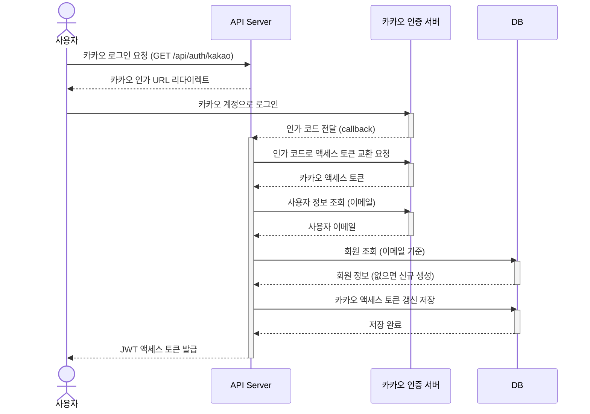
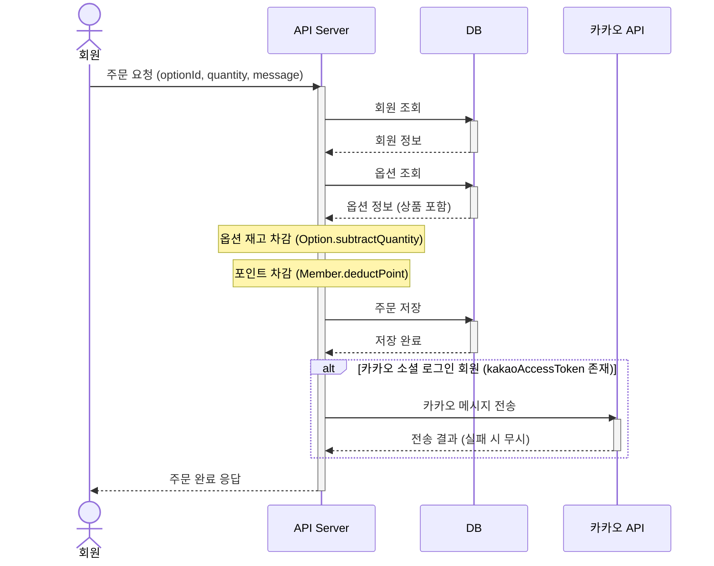

# 선물하기 도메인 모델링

## 용어 사전

> 용어 사전은 프로젝트에 참여하는 도메인 전문가, 개발자, 기획자 등 다양한 직군 간의 의사소통을 명확하게 하기 위한 도구입니다.
> 이 사전은 하위 도메인을 기준으로 도메인 내 개념을 일관되게 설명합니다.

하위 도메인은 비즈니스 전체 흐름 속에서 각 영역이 무엇을 책임지는지에 따라 자연스럽게 나뉘는 주제 영역입니다.

### 하위 도메인

| 하위 도메인 | 설명 |
|-------------|------|
| Member | 회원 가입, 로그인, 포인트 관리 |
| Auth | 카카오 소셜 로그인 기반 인증, JWT 토큰 발급 및 검증 |
| Category | 상품 카테고리 등록 및 수정 |
| Product | 상품 등록, 조회, 수정, 삭제 |
| Option | 상품 옵션 등록, 수량 관리 |
| Order | 선물 주문 처리, 포인트 차감, 카카오 메시지 전송 |
| Wish | 위시리스트 상품 추가, 삭제, 조회 |

---

### Member (회원)

| 한글명 | 영문명 | 설명 |
|--------|--------|------|
| 회원 | Member | 서비스에 가입한 사용자 도메인 객체 |
| 회원 ID | id | 내부 시스템 고유 식별자 |
| 이메일 | Email | 값 객체. 회원 식별 및 로그인에 사용. 중복 불가 |
| 비밀번호 | Password | 값 객체. 암호화되어 저장되는 인증 수단. 카카오 로그인 회원은 미설정 가능 |
| 포인트 | Point | 값 객체. 상품 구매에 사용되는 잔액. 0 이상의 정수 |
| 카카오 액세스 토큰 | KakaoAccessToken | 값 객체. 카카오 메시지 전송에 사용. 카카오 소셜 로그인 회원에게만 존재 |

---

### Auth (인증)

| 한글명 | 영문명 | 설명 |
|--------|--------|------|
| JWT 액세스 토큰 | AccessToken | 값 객체. 로그인 성공 시 발급되는 JWT 형식의 인증 토큰 |
| 인증 주체 | LoginMember | `@AuthenticationPrincipal`로 주입받는 인증된 회원 정보 객체 |
| 카카오 인가 코드 | code | 카카오 인증 서버가 콜백으로 전달하는 일회성 코드 |
| 카카오 액세스 토큰 | kakaoAccessToken | 카카오 API 호출에 사용하는 OAuth 액세스 토큰 |
| 토큰 제공자 | JwtProvider | JWT 생성, 검증, payload 추출을 담당하는 저수준 컴포넌트 |

---

### Category (카테고리)

| 한글명 | 영문명 | 설명 |
|--------|--------|------|
| 카테고리 | Category | 상품을 분류하는 도메인 객체 |
| 카테고리 ID | id | 카테고리 고유 식별자 |
| 카테고리명 | CategoryName | 값 객체. 카테고리의 이름 |
| 카테고리 색상 | CategoryColor | 값 객체. 카테고리를 시각적으로 구분하는 색상 코드 |
| 카테고리 이미지 | CategoryImage | 값 객체. 카테고리 대표 이미지 URL |
| 설명 | description | 카테고리에 대한 부가 설명 |

---

### Product (상품)

| 한글명 | 영문명 | 설명 |
|--------|--------|------|
| 상품 | Product | 선물하기 서비스에서 구매 및 위시리스트 등록의 대상이 되는 핵심 도메인 객체 |
| 상품 ID | id | 상품 고유 식별자 |
| 상품명 | ProductName | 값 객체. 상품의 이름. "카카오" 포함 여부에 대한 정책을 캡슐화 |
| 상품 가격 | ProductPrice | 값 객체. 상품의 판매 가격. 양수 제약을 캡슐화 |
| 상품 이미지 | ProductImage | 값 객체. 상품 대표 이미지 URL |
| 카테고리 | category | 상품이 속한 카테고리 (필수) |
| 옵션 목록 | options | 상품에 속한 옵션들의 묶음. 최소 1개 이상 존재해야 함 |

---

### Option (옵션)

| 한글명 | 영문명 | 설명 |
|--------|--------|------|
| 옵션 | Option | 상품에 속하는 구매 단위 선택지 도메인 객체 |
| 옵션 ID | id | 옵션 고유 식별자 |
| 옵션명 | OptionName | 값 객체. 같은 상품 내에서 중복될 수 없는 옵션 이름 |
| 재고 수량 | Quantity | 값 객체. 해당 옵션의 구매 가능 수량. 0 이상의 정수 |
| 상품 | product | 이 옵션이 속한 상품 |

---

### Order (주문)

| 한글명 | 영문명 | 설명 |
|--------|--------|------|
| 주문 | Order | 회원이 특정 옵션을 선택해 선물을 주문하는 도메인 객체 |
| 주문 ID | id | 주문 고유 식별자 |
| 주문 수량 | Quantity | 값 객체. 주문한 옵션의 수량 |
| 주문 메시지 | OrderMessage | 값 객체. 선물 수신자에게 전달할 메시지 |
| 주문 일시 | orderDateTime | 주문이 접수된 시각 |
| 옵션 | option | 주문한 상품 옵션 |
| 회원 ID | memberId | 주문을 요청한 회원의 식별자 |

---

### Wish (위시리스트)

| 한글명 | 영문명 | 설명 |
|--------|--------|------|
| 위시리스트 | Wish | 회원이 관심 있는 상품을 보관하는 도메인 객체 |
| 위시 ID | id | 위시리스트 항목의 고유 식별자 |
| 회원 ID | memberId | 위시리스트를 소유한 회원의 식별자 |
| 상품 | product | 위시리스트에 담긴 상품 |

---

## 모델링 하기

> 모델링은 하위 도메인을 기준으로 도메인 객체를 설계하고, 해당 객체의 속성(상태), 행위(기능), 정책(제약사항)을 구분하여 구조화하는 작업입니다.
>
> 도메인 객체 내부에 비즈니스 규칙을 캡슐화하는 것을 목표로 하며, 값 객체(Value Object)를 통해 각 개념의 도메인 의미와 제약사항을 명확히 표현합니다.
>
> 본 프로젝트에서는 JPA를 사용하므로, 도메인 객체를 JPA 엔티티로 정의하고, 이를 기준으로 모델링을 진행합니다.

---

### Member (회원)

속성(상태)

- 회원은 이메일(`Email`), 비밀번호(`Password`), 포인트(`Point`), 카카오 액세스 토큰(`KakaoAccessToken`)을 가진다.
- 카카오 소셜 로그인으로 가입한 회원은 비밀번호 없이 이메일과 카카오 액세스 토큰만으로 식별된다.
- 포인트 초기값은 0이며, 충전 또는 주문에 따라 변동된다.

행위(기능)

- 회원은 이메일과 비밀번호로 가입할 수 있다.
- 회원은 포인트를 충전할 수 있다.
- 회원은 주문 시 포인트를 차감할 수 있다.
- 카카오 소셜 로그인 시 카카오 액세스 토큰을 갱신할 수 있다.

정책(제약사항)

- 이메일은 중복 가입이 불가하다. (`MemberEmailPolicy`)
- 포인트 충전 금액과 차감 금액은 1 이상이어야 한다.
- 포인트 차감 시 잔액이 주문 금액보다 적으면 주문이 불가하다.

---

### Auth (인증)

속성(상태)

- 카카오 로그인 요청 시 카카오 인증 서버로부터 인가 코드(`code`)를 수신한다.
- 인가 코드를 교환하여 카카오 액세스 토큰을 발급받고, 이를 통해 사용자 이메일을 조회한다.
- 로그인에 성공하면 서버는 JWT 형식의 액세스 토큰(`AccessToken`)을 발급한다.

행위(기능)

- 카카오 OAuth 인가 URL을 생성하여 반환한다.
- 인가 코드를 카카오 액세스 토큰으로 교환한다.
- 카카오 사용자 정보를 조회하여 회원을 등록하거나 기존 회원 정보를 갱신한다 (Upsert).
- JWT 액세스 토큰을 발급하여 반환한다.

정책(제약사항)

- 카카오 인가 코드는 일회성이며 재사용할 수 없다.
- JWT 액세스 토큰은 DB에 저장하지 않고 stateless하게 처리된다.
- 만료된 액세스 토큰으로의 요청은 인증 실패로 간주한다.
- 어드민 키, 클라이언트 시크릿 등 민감 정보는 코드 저장소에 포함하지 않는다.

#### 처리 흐름: 카카오 소셜 로그인

---

### Category (카테고리)

속성(상태)

- 카테고리는 카테고리명(`CategoryName`), 색상(`CategoryColor`), 이미지(`CategoryImage`), 설명을 가진다.

행위(기능)

- 관리자는 카테고리를 등록할 수 있다.
- 관리자는 카테고리 정보(이름, 색상, 이미지, 설명)를 수정할 수 있다.

정책(제약사항)

- 형식 검증(이름 길이 등)은 API 계층에서 처리한다.

---

### Product (상품)

속성(상태)

- 상품은 상품명(`ProductName`), 상품 가격(`ProductPrice`), 상품 이미지(`ProductImage`), 카테고리, 옵션 목록을 가진다.
- 각 값 객체는 해당 도메인 규칙을 내부에 캡슐화한다.
- 옵션 목록은 상품에 종속되며 (Cascade), 상품 삭제 시 함께 삭제된다.

행위(기능)

- 관리자는 상품을 등록할 수 있다.
- 관리자는 상품 정보(이름, 가격, 이미지, 카테고리)를 수정할 수 있다.
- 관리자는 상품을 삭제할 수 있다.
- 회원은 상품 목록을 카테고리 기준으로 조회할 수 있다.

정책(제약사항)

- 상품명에 "카카오"가 포함된 경우, MD와 협의된 경우에만 등록 가능하다. (`ProductNamePolicy`)
- 상품에는 옵션이 반드시 1개 이상 존재해야 한다. (`OptionPolicy`)

---

### Option (옵션)

속성(상태)

- 옵션은 옵션명(`OptionName`), 재고 수량(`Quantity`)을 가지며, 반드시 특정 상품(`Product`)에 속한다.

행위(기능)

- 관리자는 상품에 옵션을 추가할 수 있다.
- 관리자는 옵션 정보(이름, 수량)를 수정할 수 있다.
- 관리자는 옵션을 삭제할 수 있다.
- 주문 시 해당 옵션의 재고 수량을 차감할 수 있다.

정책(제약사항)

- 같은 상품 내에서 옵션명은 중복될 수 없다. (`OptionPolicy`)
- 상품의 마지막 옵션은 삭제할 수 없다. (`OptionPolicy`)
- 재고 수량보다 많은 수량을 차감할 수 없다.

---

### Order (주문)

속성(상태)

- 주문은 선택한 옵션, 회원 ID, 주문 수량(`Quantity`), 주문 메시지(`OrderMessage`), 주문 일시를 가진다.
- 주문 일시는 주문 접수 시점에 자동으로 기록된다.

행위(기능)

- 회원은 원하는 상품 옵션을 선택해 선물을 주문할 수 있다.
- 회원은 자신의 주문 내역을 페이지 단위로 조회할 수 있다.

정책(제약사항)

- 주문 시 옵션의 재고가 주문 수량 이상이어야 한다.
- 주문 금액(상품 가격 x 수량)만큼 회원의 포인트가 차감된다.
- 포인트 잔액이 주문 금액보다 적으면 주문이 불가하다.
- 카카오 소셜 로그인 회원은 주문 완료 시 카카오 메시지로 알림을 받는다. 단, 알림 전송 실패 시에도 주문은 정상 처리된다.

#### 처리 흐름: 상품 주문

---

### Wish (위시리스트)

속성(상태)

- 위시리스트 항목은 회원 ID와 상품(`Product`)으로 구성된다.

행위(기능)

- 회원은 관심 상품을 위시리스트에 추가할 수 있다.
- 회원은 위시리스트에서 상품을 삭제할 수 있다.
- 회원은 자신의 위시리스트를 페이지 단위로 조회할 수 있다.

정책(제약사항)

- 위시리스트 조회, 추가, 삭제는 인증된 회원만 수행할 수 있다.
